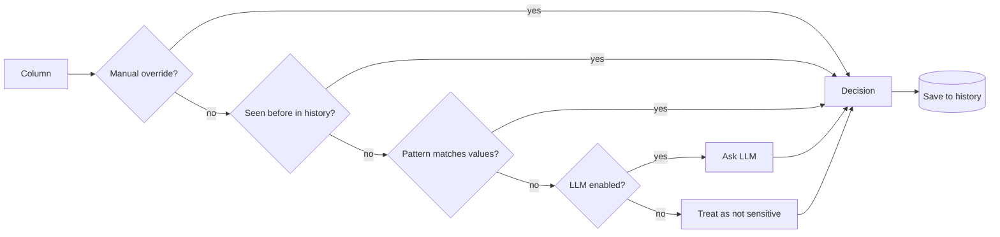
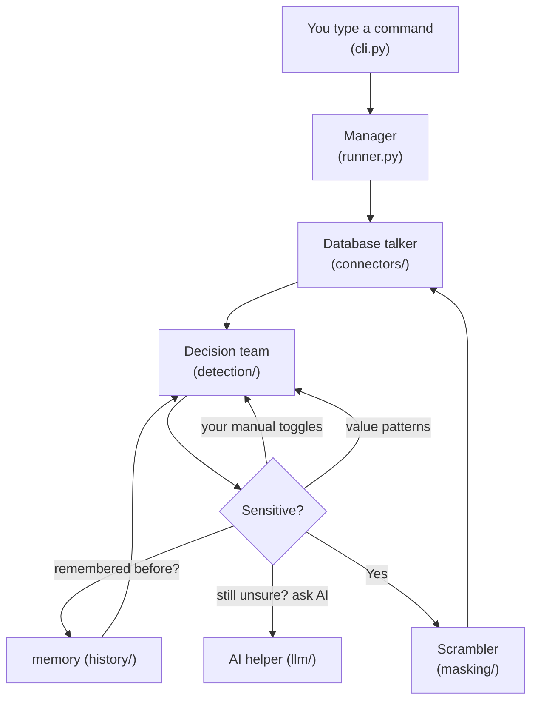
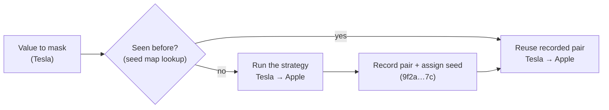
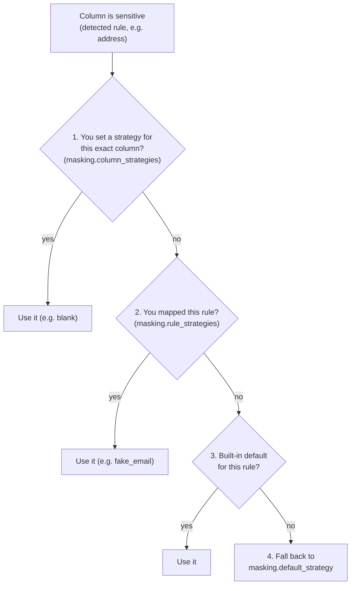
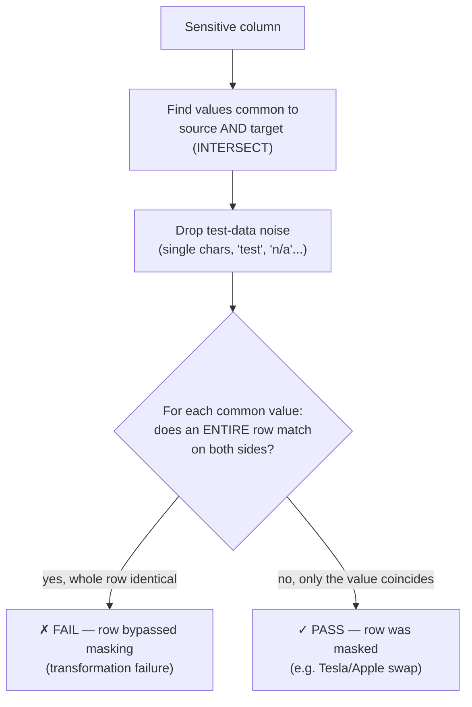

# Sensitive_Data_Protection_in_Testing_Environment

**Discover and mask sensitive data in any database — open source, for everyone.**

`datamask` scans a database, decides which columns hold sensitive data,
transforms that data so it is safe to use in lower environments (dev, test,
demos, analytics), and then **validates** that the masking actually worked — all
while staying realistic and internally consistent.

It is a ground-up, general-purpose rebuild of an internal company tool — with no
proprietary endpoints, no hard-coded company rules, and support for any
database.

---

## Why

Teams constantly copy production data into test systems. That leaks names,
emails, SSNs, and more. `datamask` finds the sensitive columns and rewrites
them with believable fakes (or nulls/blanks), so your test data looks real but
exposes no one.

---

## Key features

| # | Feature | Where |
|---|---------|-------|
| 1 | **Works with any database** — one SQLAlchemy-based connector drives PostgreSQL, MySQL/MariaDB, SQL Server, Oracle, SQLite, and more. | [`connectors/`](src/datamask/connectors) |
| 2 | **Historical decisions** — every classification is saved and reused, so masking is reproducible and consistent across runs. | [`history/`](src/datamask/history) |
| 3 | **Pattern matching** — data-driven heuristics (e.g. values containing `@` ≈ email) flag sensitive columns for free, with no LLM. | [`detection/patterns.py`](src/datamask/detection/patterns.py) |
| 4 | **LLM fallback** — when patterns/history are inconclusive, optionally ask an LLM. Talk to OpenAI **or a fully local model** (Ollama/LM Studio) directly — no corporate wrapper. | [`llm/`](src/datamask/llm) |
| 5 | **Manual sensitivity toggles** — a YAML file lets you force any field sensitive or safe, overriding automation. | [`detection/overrides.py`](src/datamask/detection/overrides.py) |
| 6 | **ETL / masking engine** — fake-value replacement (name→name, US city→US city), shuffle, format-preserving random, redaction, and null/blank. Format and length are preserved (a 6-char password → another 6-char string). | [`masking/`](src/datamask/masking) |
| 7 | **Validation** — after masking, verify it worked: row counts match, schema elements match, and a row-based check proves every sensitive value was truly masked. | [`validation/`](src/datamask/validation) |
| 8 | **Seed map** — every `original → masked` pair is recorded and given a seed token, so a value masks the same way forever, across tables, databases and future runs. On by default. | [`masking/seed_store.py`](src/datamask/masking/seed_store.py) |

---

## How a decision is made

For each column the pipeline tries layers in priority order and stops at the
first conclusive one:



Every decision is written back to the history store, so the next run is faster
and consistent.

---

## How it works — a plain-English tour

The project looks like a lot of folders, but it's really just a small "assembly
line" where **each folder has one job**. Your data flows left to right:

> Connect to a database → look at each column → decide if it's sensitive → if it
> is, scramble it.



Here is what each piece does, in the order it gets used:

| Piece | Think of it as... | What it does |
|-------|-------------------|--------------|
| [`cli.py`](src/datamask/cli.py) | the **buttons** | Catches the command you type (`scan`, `mask`) and starts the job. |
| [`config.py`](src/datamask/config.py) | the **settings reader** | Loads your settings file so passwords/options aren't hard-coded in the program. |
| [`runner.py`](src/datamask/runner.py) | the **manager** | Coordinates everyone: connect → analyze each column → mask the sensitive ones. |
| [`connectors/`](src/datamask/connectors) | the **database talker** | One worker that speaks to *any* database (Oracle, SQL Server, MySQL, Postgres…). Replaces the separate Oracle + SQL Server code from the old script. |
| [`detection/`](src/datamask/detection) | the **decision team** | Decides "is this column sensitive?" using your toggles, value patterns, memory, and (optionally) AI — in that order, stopping at the first confident answer. |
| [`history/`](src/datamask/history) | the **memory** | Remembers past decisions so results stay consistent and runs get faster. |
| [`llm/`](src/datamask/llm) | the **AI helper** | Only asked when everything else is unsure. Talks straight to OpenAI **or a private model on your own machine** — no company middle-man. |
| [`masking/`](src/datamask/masking) | the **scrambler** | Does the actual replacement (fake name, fake city, shuffle, blank, etc.), keeping the same shape and being consistent. |
| [`validation/`](src/datamask/validation) | the **inspector** | After masking, double-checks the result: same row counts, same structure, and no sensitive value left behind. |

And the non-code support files:

| File/folder | Purpose |
|-------------|---------|
| [`config/`](config) | Your editable settings files (copy the `.example` ones). |
| [`examples/quickstart.py`](examples/quickstart.py) | A tiny runnable demo so you can watch it work. |
| [`tests/`](tests) | Automatic checks that prove everything still works. |
| `pyproject.toml` / `requirements.txt` | The "shopping list" of tools it installs. |

**The one-line summary:** instead of one giant file doing ten jobs, you now have
eight small workers each doing one job — same idea as the original, just
organized so anyone can reuse and upgrade it piece by piece.

---

## Install

```bash
# core
pip install -e .

# add the database driver(s) you need
pip install -e ".[postgres]"     # or [mysql], [mssql], [oracle]
pip install -e ".[databases]"    # all drivers

# optional LLM support
pip install -e ".[openai]"       # OpenAI / OpenAI-compatible
pip install -e ".[local]"        # local HTTP models (Ollama, LM Studio)

# everything
pip install -e ".[all]"
```

> Requires Python 3.9+.

---

## Quick start

```bash
# 1. Configure
cp config/datamask.config.example.yaml config/datamask.config.yaml
cp config/datamask.fields.example.yaml config/datamask.fields.yaml
# edit config/datamask.config.yaml (DB connection, masking rules, ...)

# 2. Scan — classify every column (no data is changed)
datamask scan --config config/datamask.config.yaml

# 3. Preview masking (dry-run, nothing written)
datamask mask --config config/datamask.config.yaml

# 4. Apply masking (writes masked values back)
datamask mask --config config/datamask.config.yaml --apply

# 5. Validate — verify masking worked (needs source_database in the config)
datamask validate --config config/datamask.config.yaml

# Inspect recorded decisions / tracked pairs / list strategies
datamask history --config config/datamask.config.yaml
datamask seeds   --config config/datamask.config.yaml
datamask strategies
```

Prefer code? See [`examples/quickstart.py`](examples/quickstart.py) for a
self-contained SQLite demo:

```bash
python examples/quickstart.py
```

---

## Configuration

Two YAML files that work as a pair (the first points at the second). Secrets use
`${ENV_VAR}` placeholders so you never commit credentials.

- **[`config/datamask.config.yaml`](config/datamask.config.example.yaml)** — the
  main settings: database connection, detection tuning, history store, LLM
  settings, and masking rules. Answers *"how do I connect and how do I scramble?"*
- **[`config/datamask.fields.yaml`](config/datamask.fields.example.yaml)** — your
  manual per-field overrides. Answers *"which columns are sensitive (or safe)?"*
  The main config references this file via `detection.overrides_file`.

> The main config also has a `source_database:` and `validation:` section used
> only by `datamask validate` (to compare the masked DB against the original).

> Copy the bundled `*.example.yaml` files (drop the `.example`) to create your
> own, then edit them.

### Masking strategies

A **strategy** is *how* a value gets scrambled. Built-ins:

| Strategy | Effect |
|----------|--------|
| `fake_name`, `fake_first_name`, `fake_last_name` | Replace with a consistent fake from the name dictionaries |
| `fake_city` | Replace a US city with another US city |
| `fake_email` | Consistent fake email, **keeps the original domain** |
| `format_random` | Random chars, **same length & digit/letter/separator layout** |
| `shuffle` | Deterministically shuffle the characters |
| `redact` | Hide alphanumerics with `*`, keep separators |
| `null` | Set the column to SQL `NULL` |
| `blank` | Set the column to an empty string |

All strategies are **deterministic** (seeded), so the same input always maps to
the same output — and the [seed map](#consistency--the-seed-map) records each
pair so that stays true even when dictionaries or the seed change.

Add your own with `register_strategy(...)`, and your own value lists with
`register_dictionary(...)`.

---

## Consistency — the seed map

Masked data is only useful if it is **consistent**: if `Tesla` becomes `Apple`,
it must become `Apple` in every column, every table, and every future run.
Otherwise joins break and last month's test database disagrees with this
month's.

`masking.seed` alone gets you *recomputability* — strategies derive their RNG
from `sha256(seed + value)`, so the same input recomputes to the same output.
But nothing is written down, which means the mapping quietly changes whenever
its inputs do:

| Change | Effect without the seed map |
|--------|-----------------------------|
| Someone sorts `us_cities.txt` | **every** mapping changes |
| Someone appends one new city | some mappings shift |
| `masking.seed` is edited | **every** mapping changes |

The **seed map** fixes this by persisting the decision instead of recomputing
it. The first time a value is masked, the pair is written down and assigned a
**seed** — a short stable token identifying that pair. Every later run looks the
pair up and reuses it.



```yaml
masking:
  seed_map:
    enabled: true      # ON by default — set false for recompute-only behaviour
    url:               # blank = sqlite:///datamask_seedmap.db
    salt:              # see "Privacy" below
    untracked_strategies: ["null", "blank", "redact"]
```

### How the seed is calculated

The seed is **derived from the value, not invented at random** — that is the
whole trick. Because the same value always fingerprints to the same seed, a
future run can find the pair it belongs to without ever having stored the value
itself:

```
fingerprint = sha256( salt | strategy | original_value )

  value_hash = fingerprint              (full 64 hex chars — the lookup key)
  seed       = fingerprint[:16]         (short token — how you refer to the pair)
```

Worked example, masking `Tesla` in a `fake_city` column:

| Step | What happens |
|------|--------------|
| 1 | Fingerprint `Tesla` → `71d943727714753f…` (full hash) |
| 2 | Look up that hash in the seed map → **miss**, first time seen |
| 3 | Run the `fake_city` strategy → `Tucson` |
| 4 | Store the row: `seed=71d943727714753f`, `scope=fake_city`, `value_hash=71d9…`, `masked=Tucson` |
| 5 | **Next run**, `Tesla` fingerprints to `71d94372…` again → **hit** → return `Tucson` without running the strategy at all |

Step 5 is why the mapping is stable. The strategy — and therefore the
dictionary contents, the dictionary order, and `masking.seed` — is only ever
consulted **once per distinct value, ever**. After that the recorded answer
wins, so later changes to any of those inputs cannot move an existing pair.

A few consequences worth knowing:

- **The seed is an identifier, not a secret.** It is safe to quote in a ticket
  or a log to refer to a specific pair. It reveals nothing on its own.
- **The same value in two different strategies gets two different seeds**,
  because the strategy name is part of the fingerprint. `Tesla` masked as a city
  and `Tesla` masked as a name are separate pairs that cannot collide.
- **Only the salt is sensitive.** Change it and every fingerprint changes, so
  every existing pair becomes unreachable.
- **New values are still free to appear.** A value never seen before simply
  takes step 3 and becomes a new tracked pair; nothing has to be pre-registered.

Inspect what has been tracked:

```bash
datamask seeds --config config/datamask.config.yaml
```

```
Tracked pairs: 5

SEED               SCOPE              MASKED VALUE
71d943727714753f   fake_city          Tucson
60e256a96b19d5d1   fake_city          Seattle
```

### Scope

Pairs are namespaced **per strategy**, so a value masks identically in every
column that uses that strategy — `Tesla` in `customers.company` and `Tesla` in
`orders.vendor` both become the same thing, keeping joins intact.

### Privacy

**Original values are never stored.** The lookup key is a salted SHA-256 hash,
so the store holds `hash(Tesla) → "Apple"`, never `"Tesla" → "Apple"`. You
cannot read it to discover what a value became — only look up a value you
already hold — so it is not a reversal table.

One honest limit: by default the salt is generated once and kept *inside* the
store, which is stable with zero configuration but means anyone holding the
store also holds the salt. Since masked columns often draw on small, guessable
value sets, such a holder could hash candidate values to test whether one is
present. If that matters to you, set `salt` to an external secret:

```yaml
masking:
  seed_map:
    salt: ${DATAMASK_SEED_SALT}   # never written to disk
```

> ⚠️ Changing the salt **orphans every existing pair** — they can no longer be
> found and values start mapping afresh. Pick it once and keep it with your
> backups. The seed map database is itself worth backing up: lose it and future
> runs will re-derive new mappings that disagree with already-masked databases.

### Turning it off

Set `masking.seed_map.enabled: false`. Masking stays deterministic within a run,
but nothing is persisted and mappings revert to drifting whenever a dictionary
or the seed changes.

### How is the masking rule chosen?

This is the important part, and **you are always in control**. When the scanner
flags a column as sensitive it also guesses *what kind* of data it is (the
"rule", e.g. `email`, `full_name`, `address`). The engine then picks a strategy
by checking these places **in order and stops at the first match**:



1. **`column_strategies`** — *your* per-column decision (highest priority).
2. **`rule_strategies`** — *your* mapping for a kind of data (applies to every
   column of that kind).
3. **Built-in default** for that rule (sensible out-of-the-box behavior).
4. **`default_strategy`** — the catch-all when nothing else matches.

#### Example: you decide how to handle a long `notes` field

Free-text fields are exactly where it should be *your* call — randomize it, or
just wipe it. Put the column in `column_strategies` and pick:

```yaml
masking:
  default_strategy: format_random
  column_strategies:
    notes: blank          # empty it out
    # notes: format_random  # ...or scramble it instead
    # notes: redact         # ...or keep length but hide content (****)
    # notes: null           # ...or set it to SQL NULL
  rule_strategies:
    email: fake_email
    full_name: fake_name
```

Because `column_strategies` wins, your `notes` choice overrides whatever the
scanner guessed for that column. Everything else still follows the rule
mappings. Run `datamask strategies` to see every available option.

---

## Validation — did masking actually work?

Masking is only trustworthy if you can prove it. After you mask, point
`datamask validate` at **both** databases — the original (`source_database`) and
the masked one (`database`) — and it runs three independent checks:

```bash
datamask validate --config config/datamask.config.yaml
```

| # | Check | What it proves |
|---|-------|----------------|
| 1 | **Row counts** | Each table has the *same number of rows* on both sides. Masking changes values, never adds/drops rows. |
| 2 | **Schema elements** | Columns/types, primary key, indexes, foreign keys, and unique/check constraints still match. |
| 3 | **Masking completeness** | Every sensitive value was *really* masked — using a row-based check (below). |

The command exits non-zero if anything fails, so you can use it as a **CI /
Jenkins gate**.

### Why check #3 is row-based (the clever part)

A naive "are there still common values?" check gives false alarms. With
dictionary masking, a real value can be replaced by *another real value that
also exists in the data*:

> The dictionary has both **Tesla** and **Apple**, and so does your data. After
> masking, `Tesla → Apple` and `Apple → Tesla`. The column still shows "Tesla"
> and "Apple", so a column-level check screams "unmasked!" — but the data **is**
> masked.

So datamask checks at the **row** level instead:



Only when an **entire row** (all comparable columns) is identical in both
databases is it flagged as a genuine unmasked row. This is database-agnostic —
the comparison happens in Python, so source and target can even be *different*
engines (e.g. Oracle → PostgreSQL).

> **Triggers & grants:** comparing these isn't portable across databases, so
> they're left as a clearly-marked extension point (override
> `Connector.schema_elements`) rather than half-working. Columns, keys, indexes,
> FKs and constraints *are* compared out of the box.

---

## Extending

- **New data source** (REST API, Mongo, CSV lake): subclass
  [`Connector`](src/datamask/connectors/base.py).
- **New detection pattern**: add a `Pattern` to
  [`patterns.py`](src/datamask/detection/patterns.py).
- **New masking rule**: `register_strategy("my_rule", fn)`.
- **New fake dictionary**: `register_dictionary("countries", [...])`.

---

## Project layout

```
src/datamask/
├── config.py            # YAML config schema + ${ENV} expansion
├── runner.py            # high-level orchestration (scan / mask)
├── cli.py               # `datamask` command-line interface
├── connectors/          # universal SQLAlchemy connector (feature #1)
├── detection/
│   ├── patterns.py      # value-based heuristics (feature #3)
│   ├── overrides.py     # manual sensitivity toggles (feature #5)
│   ├── pipeline.py      # orchestrates the layers
│   └── result.py        # Decision / Sensitivity types
├── history/             # decision store for consistency (feature #2)
├── llm/                 # OpenAI + local providers (feature #4)
├── masking/             # ETL engine, strategies, dictionaries (feature #6)
│   └── seed_store.py    # seed map: durable original->masked pairs (feature #8)
└── validation/          # post-masking checks: counts, schema, completeness (#7)
    ├── row_count.py            # check #1
    ├── schema_elements.py      # check #2
    ├── masking_completeness.py # check #3 (row-based)
    └── validator.py            # runs them all
```

---

## Safety notes

- `mask` is a **dry-run by default**. It only writes when you pass `--apply`
  (or set `masking.dry_run: false`).
- Always run against a **copy** of production data, never production itself.
- Review the scan report and overrides before applying.

---

## Status

This is an initial framework (v0.1). Several pieces are intentionally simple so
you can refine them: the bundled dictionaries are small, the pattern catalogue
is a starting point, and LLM prompts can be tuned. Contributions welcome.

## License

[MIT](LICENSE)
